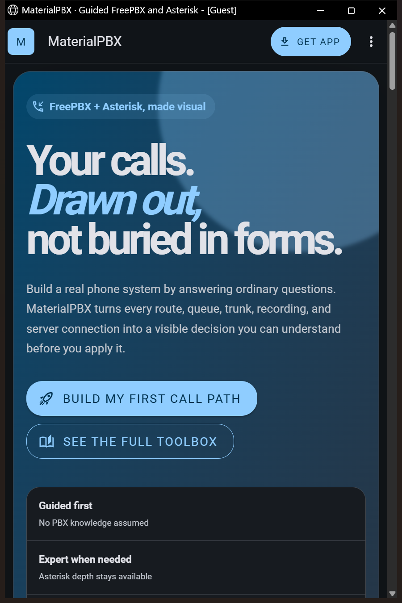
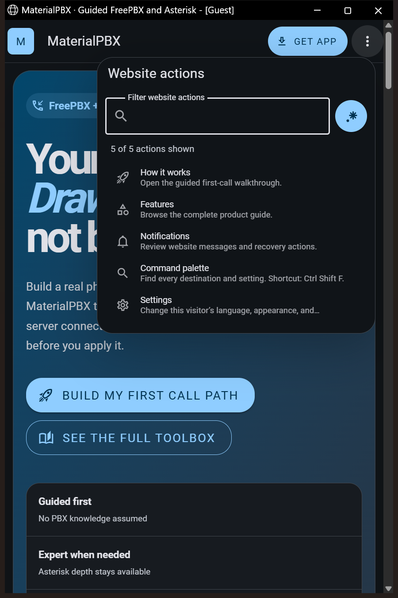
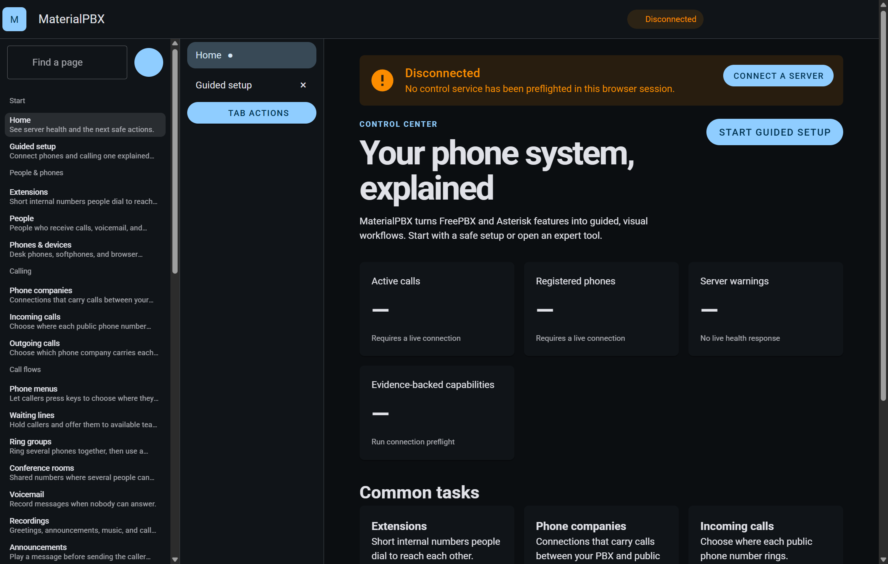

# MaterialPBX

MaterialPBX is a guided, visual control surface for FreePBX and Asterisk. It keeps a beginner-friendly path beside an expert view, replaces configuration-only forms with typed controls wherever values can be discovered, and labels every disconnected or unverified state honestly.

- Documentation site: <https://ding-ding-projects.github.io/MaterialPBX/>
- Managed production site: <https://materialpbx.yeredow264.chatgpt.site/>
- Install candidate: [MaterialPBX 0.1.2 for Windows](https://github.com/Ding-Ding-Projects/MaterialPBX/releases/latest/download/MaterialPBX-0.1.2-x64-Setup.exe) — this stable URL resolves only when the latest verified non-draft release contains the 0.1.2 asset. The installer is unsigned, so Windows may show an unknown-publisher or SmartScreen warning.
- Delivery: production Linux hosting plus a Windows desktop lab.
- License: GPL-3.0-or-later.

## Contents

- [Guided onboarding](docs/features/onboarding.md)
- [Feature documentation](docs/features/README.md)
- [User guide](docs/user-guide/README.md)
- [Build and packaging](#build-and-packaging)
- [Release evidence and scale estimate](#release-evidence-and-scale-estimate)
- [Architecture and safety boundary](#architecture-and-safety-boundary)
- [Roadmap](ROADMAP.md)
- [Handoff](HANDOFF.md)

<details>
<summary>Real interface captures</summary>

These captures came from the built `/MaterialPBX/` client at the current uncommitted candidate, driven on the approved cheap named hidden-desktop route. They are local built-artifact evidence, not proof that this candidate has been committed or published.








</details>

<details>
<summary>Features and interaction model</summary>

The current interface includes guided and expert destinations for extensions, people, devices, trunks, incoming and outgoing routes, IVRs, queues, conferences, voicemail, recordings, announcements, opening hours, call detail records, call events, calendars, presence, parking, paging, WebRTC, paired PBX servers, backups, operations, and security.

It also includes browser-style tabs, settings, language modes, independent tone controls, narration choices, appearance controls, a continuous color picker and color translator, attention accommodations, schedules, local personal-vocabulary loading, local history, notification history, exports, command palette routing, offline documentation, and protected destructive actions.

The local Ollama suite manager and universal file converter are intentionally excluded by explicit project direction.

</details>

<details>
<summary>Build and packaging</summary>

On Windows, run `build.bat` for a runnable build or `build-installer.bat` for the unsigned Squirrel.Windows installer. Both call `download-dependencies.bat`, support `/s` and `--silent`, and install missing user-scoped tooling from canonical sources.

Direct commands on a prepared machine:

```powershell
pnpm install
pnpm assets
pnpm build
pnpm package:windows
```

Code signing is intentionally disabled. The installer may show an unknown-publisher or SmartScreen warning.

The reproducible line counter reads an exact committed tree and prints the same categorized table used in release notes:

```powershell
node scripts/count-lines.mjs --revision HEAD
```

The focused release-evidence contract is `pnpm check:release-evidence`. See [Release evidence](docs/features/release-evidence.md) for category definitions, surviving-line attribution, canonical public-image provenance, supported installer and native-host packaging, exact published-asset verification, timing, and failure behavior.

</details>

<details>
<summary>Release evidence and scale estimate</summary>

The latest measured committed baseline is `7de68dbfbd6c951038d37e7d2dbef06a64dcc2b4`. The committed counter reports 14,011 total and 12,364 nonblank hand-written project lines at that commit; generated files and dependency lockfiles are excluded from that project figure and remain visible in separate rows.

Estimated manual implementation effort: **about 515–1,030 engineer-days (24–49 engineer-months)**. This is an estimate, not measured history. The disclosed calculation is `12,364 nonblank project lines ÷ 30–15 reviewed production lines per engineer-day × 1.25 integration/documentation multiplier`. It excludes generated assets, dependency lockfiles, installed dependencies, and build output exactly as the counter does. The range is informational and is not a productivity claim.

Each successful release runs the same counter at its exact target commit, publishes the full table and attribution arithmetic in its release notes, and supersedes this convenience baseline with release-specific evidence.

</details>

<details>
<summary>Architecture and safety boundary</summary>

The browser and desktop shells are clients of a typed control-service contract. A disconnected client returns empty real-data collections and refuses mutations. The interface therefore never substitutes sample data for a live PBX result.

The Windows desktop app is a lab and management client. The production telephony runtime belongs on the dedicated Linux host described by the deployment artifacts. The public site is landing, documentation, download, status, settings, and link content only; it is not the PBX runtime.

The web and Windows interfaces can preflight a real MaterialPBX control-service endpoint, read server health and the evidence-backed capability registry, distinguish offline, permission, incompatibility, degraded, read-only, and live states, and load only records returned by that server. The successful non-secret endpoint is stored locally; the admin credential exists only in the current in-memory client and is discarded on disconnect or reload. The public documentation site never makes this connection.

The release and Pages workflows now accept push events only on `main`. Commit `41d75a5f2eb7cc7ac1426ee12fb0c4a668ed10f9` added that restriction after release-created tags recursively triggered duplicate releases. Historical duplicate releases remain immutable, and no tags or releases were deleted.

MaterialPBX consumes the published `@worldlens/design-system` package. Shared colors, themes, component defaults, and tokens stay owned by WorldLens instead of being copied here.

</details>

<details>
<summary>Verification state and scale estimate</summary>

The upgraded verification pass includes 62-row public-site checks with 62 deliberate negative regressions, 73-row installer checks with five deliberate negative regressions, 135-row runtime/deployment checks with 23 forbidden-pattern regressions, and 95-row release-evidence checks with 105 deliberate negative regressions. GitHub Pages and managed-hosting production builds both completed locally. Real built-client captures cover the public Home at desktop and narrow widths, its narrow overflow surface, and a fresh installed desktop launch. All captures used the approved cheap named hidden-desktop route and did not touch the visible desktop. The public-site captures bind to the current candidate rather than a published release; they do not prove keyboard-only behavior, contrast, a live PBX, or production telephony behavior.

The release workflow now runs the committed line counter against the exact release target; publishes source, tests and verification, styles and markup, documentation, configuration and data, generated, excluded, grand, nonblank, and surviving-line attribution totals; links digest-verified public dim-sum provenance without copying the photograph; builds through the supported installer verifier; and attaches a self-contained native-host deployment archive. It rejects reused tag refs, equal installed versions, mismatched exact-commit installer icons, incomplete native payloads, and published assets whose downloaded bytes differ from staging. The workflow still performs build, packaging, evidence, and publication only; local checks and runtime evidence remain separate.

</details>
